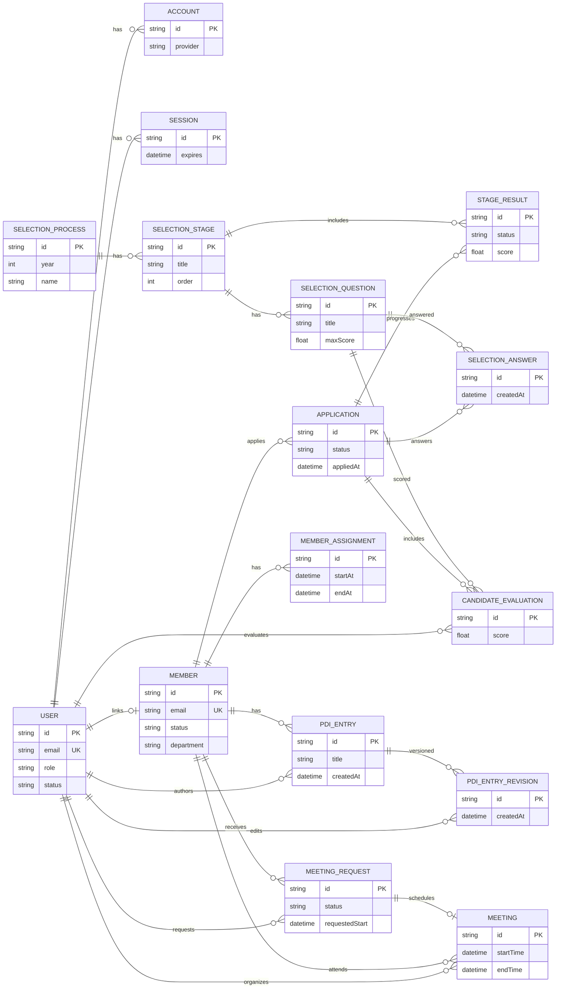
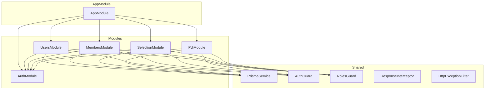

# Arquitetura

## 1. Resumo

Plataforma de gestao de pessoas com foco em processo seletivo e PDI historico. A modelagem usa um fluxo de candidatura por processo e avaliacao por etapa, com PDI versionado. O login e exclusivo por OAuth com dominio institucional. No MVP entram todos os modulos exceto reunioes.

## 2. Sumario

1. [Resumo](#1-resumo)
2. [Sumario](#2-sumario)
3. [Banco de dados](#3-banco-de-dados)
4. [Enums](#31-enums)
5. [Autenticacao e usuarios](#32-autenticacao-e-usuarios)
6. [Membros e PDI](#33-membros-e-pdi)
7. [Processo seletivo e avaliacao](#34-processo-seletivo-e-avaliacao)
8. [Agendamento e solicitacoes](#35-agendamento-e-solicitacoes)
9. [Regras de integridade](#36-regras-de-integridade)
10. [Diagrama](#37-diagrama)
11. [Stack tecnologica](#4-stack-tecnologica)
12. [Estrutura de pastas](#5-estrutura-de-pastas)
13. [API e contratos](#6-api-e-contratos)
14. [Padrao de resposta](#61-padrao-de-resposta)
15. [Paginacao](#62-paginacao)
16. [Autenticacao e autorizacao](#63-autenticacao-e-autorizacao)
17. [Convencoes de erros e codigos](#64-convencoes-de-erros-e-codigos)
18. [Schemas e DTOs](#65-schemas-e-dtos)
19. [Endpoints e payloads](#66-endpoints-e-payloads)
20. [Notas de escopo](#67-notas-de-escopo)
21. [Rotas do frontend](#7-rotas-do-frontend)
22. [Publicas](#71-publicas)
23. [Protegidas](#72-protegidas)
24. [Notas de escopo](#73-notas-de-escopo)

## 3. Banco de dados

### 3.1. Enums

```prisma
enum UserRole {
  ADMIN
  PEOPLE
  INTERVIEWER
}

enum UserStatus {
  PENDING
  APPROVED
  REJECTED
}

enum MemberStatus {
  CANDIDATE
  ACTIVE
  INACTIVE
  ALUMNI
}

enum Department {
  PEOPLE
  MARKETING
  PROJECTS
  EDUCATIONAL
}

enum Position {
  MEMBER
  DIRECTOR
  PRESIDENT
  HEAD
}

enum ApplicationStatus {
  DRAFT
  SUBMITTED
  IN_REVIEW
  APPROVED
  REJECTED
  WITHDRAWN
}

enum StageResultStatus {
  PENDING
  PASSED
  FAILED
  SKIPPED
}

enum MeetingRequestStatus {
  PENDING
  APPROVED
  REJECTED
  CANCELED
}

enum MeetingStatus {
  SCHEDULED
  COMPLETED
  CANCELED
}
```

### 3.2. Autenticacao e usuarios

```prisma
model User {
  id            String     @id @default(uuid())
  name          String?
  email         String     @unique
  emailVerified DateTime?
  image         String?

  role          UserRole   @default(PEOPLE)
  status        UserStatus @default(PENDING)

  createdAt     DateTime   @default(now())
  updatedAt     DateTime   @updatedAt

  accounts      Account[]
  sessions      Session[]

  memberId      String?    @unique
  member        Member?    @relation(fields: [memberId], references: [id])

  evaluations   CandidateEvaluation[]
  meetings      Meeting[]  @relation("OrganizerMeetings")
  pdiEntries    PdiEntry[]
  pdiRevisions  PdiEntryRevision[]
  meetingRequests MeetingRequest[]
}

model Account {
  id                String  @id @default(uuid())
  userId            String
  type              String
  provider          String
  providerAccountId String
  refresh_token     String? @db.Text
  access_token      String? @db.Text
  expires_at        Int?
  token_type        String?
  scope             String?
  id_token          String? @db.Text
  session_state     String?

  user User @relation(fields: [userId], references: [id], onDelete: Cascade)

  @@unique([provider, providerAccountId])
  @@index([userId])
}

model Session {
  id           String   @id @default(uuid())
  sessionToken String   @unique
  userId       String
  expires      DateTime
  user         User     @relation(fields: [userId], references: [id], onDelete: Cascade)

  @@index([userId])
}
```

### 3.3. Membros e PDI

```prisma
model Member {
  id               String       @id @default(uuid())
  name             String
  email            String       @unique
  universityId     String?
  gender           String?
  race             String?
  isLgbtqia        Boolean      @default(false)

  status           MemberStatus @default(CANDIDATE)
  position         Position?
  department       Department?

  joinedAt         DateTime?
  leftAt           DateTime?

  interests        String[]

  createdAt        DateTime     @default(now())
  updatedAt        DateTime     @updatedAt

  user             User?
  applications     Application[]
  meetings         Meeting[]    @relation("AttendeeMeetings")
  meetingRequests  MeetingRequest[]
  pdiEntries       PdiEntry[]
  assignments      MemberAssignment[]

  @@index([status])
  @@index([department])
  @@index([gender])
  @@index([race])
  @@index([isLgbtqia])
  @@index([interests], type: Gin)
}

model MemberAssignment {
  id          String   @id @default(uuid())
  memberId    String
  description String   @db.Text
  startAt     DateTime?
  endAt       DateTime?
  createdAt   DateTime @default(now())
  updatedAt   DateTime @updatedAt

  member      Member   @relation(fields: [memberId], references: [id], onDelete: Cascade)

  @@index([memberId])
  @@index([startAt])
}

model PdiEntry {
  id          String   @id @default(uuid())
  memberId    String
  authorId    String
  title       String
  content     String   @db.Text
  isActive    Boolean  @default(true)
  createdAt   DateTime @default(now())
  updatedAt   DateTime @updatedAt

  member      Member   @relation(fields: [memberId], references: [id], onDelete: Cascade)
  author      User     @relation(fields: [authorId], references: [id], onDelete: Cascade)
  revisions   PdiEntryRevision[]

  @@index([memberId])
  @@index([authorId])
}

model PdiEntryRevision {
  id          String   @id @default(uuid())
  pdiEntryId  String
  editorId    String
  content     String   @db.Text
  createdAt   DateTime @default(now())

  pdiEntry    PdiEntry @relation(fields: [pdiEntryId], references: [id], onDelete: Cascade)
  editor      User     @relation(fields: [editorId], references: [id], onDelete: Cascade)

  @@index([pdiEntryId])
  @@index([editorId])
}
```

### 3.4. Processo seletivo e avaliacao

```prisma
model SelectionProcess {
  id          String   @id @default(uuid())
  year        Int
  name        String
  isActive    Boolean  @default(true)
  createdAt   DateTime @default(now())
  updatedAt   DateTime @updatedAt

  stages      SelectionStage[]
  applications Application[]

  @@index([year])
}

model SelectionStage {
  id          String   @id @default(uuid())
  processId   String
  title       String
  order       Int
  createdAt   DateTime @default(now())
  updatedAt   DateTime @updatedAt

  process     SelectionProcess @relation(fields: [processId], references: [id], onDelete: Cascade)
  questions   SelectionQuestion[]
  results     StageResult[]

  @@index([processId])
  @@unique([processId, order])
}

model SelectionQuestion {
  id          String   @id @default(uuid())
  stageId     String
  title       String
  description String?  @db.Text
  maxScore    Float
  weight      Int      @default(1)
  order       Int
  createdAt   DateTime @default(now())
  updatedAt   DateTime @updatedAt

  stage       SelectionStage @relation(fields: [stageId], references: [id], onDelete: Cascade)
  evaluations CandidateEvaluation[]
  answers     SelectionAnswer[]

  @@index([stageId])
  @@unique([stageId, order])
}

model Application {
  id          String            @id @default(uuid())
  memberId    String
  processId   String
  status      ApplicationStatus @default(DRAFT)
  appliedAt   DateTime?
  notes       String?           @db.Text
  createdAt   DateTime          @default(now())
  updatedAt   DateTime          @updatedAt

  member      Member            @relation(fields: [memberId], references: [id], onDelete: Cascade)
  process     SelectionProcess  @relation(fields: [processId], references: [id], onDelete: Cascade)
  results     StageResult[]
  evaluations CandidateEvaluation[]
  answers     SelectionAnswer[]

  @@unique([memberId, processId])
  @@index([processId])
  @@index([memberId])
  @@index([status])
}

model SelectionAnswer {
  id            String   @id @default(uuid())
  applicationId String
  questionId    String
  answerText    String   @db.Text
  createdAt     DateTime @default(now())
  updatedAt     DateTime @updatedAt

  application   Application       @relation(fields: [applicationId], references: [id], onDelete: Cascade)
  question      SelectionQuestion @relation(fields: [questionId], references: [id], onDelete: Cascade)

  @@unique([applicationId, questionId])
  @@index([questionId])
  @@index([applicationId])
}

model StageResult {
  id            String            @id @default(uuid())
  applicationId String
  stageId       String
  status        StageResultStatus @default(PENDING)
  score         Float?
  notes         String?           @db.Text
  decidedAt     DateTime?
  createdAt     DateTime          @default(now())
  updatedAt     DateTime          @updatedAt

  application   Application       @relation(fields: [applicationId], references: [id], onDelete: Cascade)
  stage         SelectionStage    @relation(fields: [stageId], references: [id], onDelete: Cascade)

  @@unique([applicationId, stageId])
  @@index([stageId])
  @@index([applicationId])
  @@index([status])
}

model CandidateEvaluation {
  id            String   @id @default(uuid())
  applicationId String
  questionId    String
  evaluatorId   String?
  score         Float?
  notes         String?  @db.Text
  createdAt     DateTime @default(now())
  updatedAt     DateTime @updatedAt

  application   Application       @relation(fields: [applicationId], references: [id], onDelete: Cascade)
  question      SelectionQuestion @relation(fields: [questionId], references: [id], onDelete: Cascade)
  evaluator     User?             @relation(fields: [evaluatorId], references: [id], onDelete: SetNull)

  @@unique([applicationId, questionId])
  @@index([evaluatorId])
  @@index([applicationId])
}
```

### 3.5. Agendamento e solicitacoes

Modelagem prevista para fase futura. O MVP nao inclui rotas nem endpoints para reunioes.

```prisma
model MeetingRequest {
  id             String               @id @default(uuid())
  requesterId    String
  memberId       String
  requestedStart DateTime
  requestedEnd   DateTime
  timezone       String
  notes          String?              @db.Text
  status         MeetingRequestStatus @default(PENDING)
  createdAt      DateTime             @default(now())
  decidedAt      DateTime?

  requester      User                 @relation(fields: [requesterId], references: [id], onDelete: Cascade)
  member         Member               @relation(fields: [memberId], references: [id], onDelete: Cascade)
  meeting        Meeting?

  @@index([requesterId])
  @@index([memberId])
  @@index([status])
}

model Meeting {
  id              String        @id @default(uuid())
  meetingRequestId String?      @unique
  organizerId     String
  attendeeId      String
  title           String
  description     String?       @db.Text
  startTime       DateTime
  endTime         DateTime
  googleEventId   String?       @unique
  meetLink        String?
  status          MeetingStatus @default(SCHEDULED)
  createdAt       DateTime      @default(now())
  updatedAt       DateTime      @updatedAt

  meetingRequest  MeetingRequest? @relation(fields: [meetingRequestId], references: [id], onDelete: SetNull)
  organizer       User            @relation("OrganizerMeetings", fields: [organizerId], references: [id], onDelete: Cascade)
  attendee        Member          @relation("AttendeeMeetings", fields: [attendeeId], references: [id], onDelete: Cascade)

  @@index([organizerId])
  @@index([attendeeId])
  @@index([startTime])
}
```

### 3.6. Regras de integridade

Regras propostas para garantir consistencia e escalabilidade:

- Unicidade
  - `User.email` e `Member.email` sao unicos.
  - `Account` usa `provider + providerAccountId` como chave unica.
  - `Application` e unica por `memberId + processId`.
  - `SelectionStage` e unica por `processId + order`.
  - `SelectionQuestion` e unica por `stageId + order`.
  - `StageResult` e unica por `applicationId + stageId`.
  - `CandidateEvaluation` e unica por `applicationId + questionId`.
  - `SelectionAnswer` e unica por `applicationId + questionId`.
  - `Meeting.googleEventId` e unico quando existir.

- Indices para filtros
  - `Member.status`, `Member.department`, `Member.gender`, `Member.race`, `Member.isLgbtqia`.
  - `Member.interests` com indice GIN para busca por tags.

- Chaves estrangeiras e cascatas
  - `User -> Account/Session` com `onDelete: Cascade`.
  - `Member -> Application/PdiEntry` com `onDelete: Cascade`.
  - `SelectionProcess -> SelectionStage -> SelectionQuestion` com `onDelete: Cascade`.
  - `Application -> StageResult/CandidateEvaluation` com `onDelete: Cascade`.
  - `Application/SelectionQuestion -> SelectionAnswer` com `onDelete: Cascade`.
  - `CandidateEvaluation.evaluatorId` com `onDelete: SetNull`.

- Auditoria
  - Todas as entidades centrais usam `createdAt` e `updatedAt`.
  - PDI tem historico completo via `PdiEntryRevision`.

- Dominio institucional
  - Apenas emails `@sou.inteli.edu.br` podem autenticar.
  - Usuarios entram como `PENDING` e precisam aprovacao de `ADMIN` ou `PEOPLE`.

### 3.7. Diagrama



## 4. Stack tecnologica

- Frontend: Next.js 15+ (App Router), React, Tailwind CSS, TypeScript.
- Backend: NestJS 11, TypeScript.
- ORM: Prisma.
- Banco de dados: PostgreSQL (Supabase).
- Autenticacao: OAuth institucional com Google. O fluxo salva `x-user-id` e `x-user-role` no `localStorage` do frontend.
- Infraestrutura: Vercel (frontend) e Railway com Docker (backend).
- Padroes: API REST, contratos tipados, paginacao por cursor, validacao por DTO.
- Qualidade: ESLint, Prettier, testes unitarios e e2e no backend.

### 4.1 Diagrama de dependencia entre modulos (Backend)



Fluxo interno de cada modulo:

```text
Controller --> Service --> Repository --> PrismaService --> PostgreSQL
     |
     +-- Guards (AuthGuard, RolesGuard)
     +-- DTOs (class-validator)
```

Responsabilidades:
- **AuthModule**: Exporta `AuthGuard` para que outros modulos validem identidade via headers.
- **UsersModule**: Gerencia usuarios, aprovacao e roles. Usado por ADMIN/PEOPLE.
- **MembersModule**: CRUD de membros, atribuicoes e filtros demograficos. Exporta `MembersService`.
- **SelectionModule**: Processos, etapas, questoes, candidaturas, avaliacoes e respostas.
- **PdiModule**: Entradas de PDI com historico de revisoes automatico.
- **Shared**: PrismaService, guards, interceptors, filters e tipos compartilhados.

## 5. Estrutura de pastas

Estrutura proposta para manter separacao de responsabilidades e escalabilidade.

### 5.1. Backend (NestJS)

```text
backend/
  src/
    app.module.ts
    main.ts
    config/
      env.ts
      prisma.ts
    modules/
      auth/
        auth.controller.ts
        auth.service.ts
        auth.guard.ts
        auth.types.ts
      users/
        users.controller.ts
        users.service.ts
        users.repository.ts
        dto/
        mappers/
        types/
      members/
        members.controller.ts
        members.service.ts
        members.repository.ts
        dto/
        mappers/
        types/
      selection/
        processes/
          processes.controller.ts
          processes.service.ts
          processes.repository.ts
          dto/
        stages/
          stages.controller.ts
          stages.service.ts
          stages.repository.ts
          dto/
        questions/
          questions.controller.ts
          questions.service.ts
          questions.repository.ts
          dto/
        applications/
          applications.controller.ts
          applications.service.ts
          applications.repository.ts
          dto/
        results/
          results.controller.ts
          results.service.ts
          results.repository.ts
          dto/
        evaluations/
          evaluations.controller.ts
          evaluations.service.ts
          evaluations.repository.ts
          dto/
      pdi/
        pdi.controller.ts
        pdi.service.ts
        pdi.repository.ts
        dto/
        types/
    shared/
      database/
        prisma/
          prisma.service.ts
      interceptors/
      filters/
      pipes/
      guards/
      decorators/
      types/
      utils/
      constants/
  scripts/
    seed.ts

```

    Responsabilidades principais:

    - `modules/*`: dominio e regras de negocio por contexto.
    - `dto/`: contratos de entrada e saida com validacao.
    - `repository/`: acesso ao banco via Prisma.
    - `mappers/`: conversao entre entidades, DTOs e responses.
    - `types/`: tipos compartilhados do modulo.
    - `shared/`: componentes reutilizaveis (interceptors, guards, utils, database).
    - `config/`: configuracoes de ambiente e setup do Prisma.

### 5.2. Frontend (Next.js)

```text
frontend/
  app/
    ... (Rotas)
  components/
    ui/
    layout/
  services/
    api.ts                # Instância do Axios e Interceptors
    auth.service.ts       # Serviço de autenticação
    members.service.ts    # Interação com membros (REST)
    selection.service.ts  # Processos seletivos e candidaturas
    pdi.service.ts        # Planos de desenvolvimento
    dashboard.service.ts  # Orquestração de métricas
```

**Arquitetura Frontend (Camada de Serviços)**:
Para garantir o desacoplamento e a testabilidade, os componentes React (`page.tsx` ou Client Components) **não** importam `axios` ou `api` diretamente. Toda comunicação com a API é encapsulada em *services* no diretório `services/`.
- Esses serviços contêm o contrato (TypeScript Interfaces) e fazem o uso estrito do `getBaseUrl()`.
- Isso garante facilidade em refatorações de backend, testes unitários através de *mocks* do serviço, e segurança na escalabilidade para múltiplos ambientes (Local, Staging, Produção).

```text
    (public)/
      login/
        page.tsx
    (protected)/
      layout.tsx
      dashboard/
        page.tsx
      members/
        page.tsx
        new/
          page.tsx
        [memberId]/
          page.tsx
          pdi/
            page.tsx
            [entryId]/
              page.tsx
      selecao/
        page.tsx
        new/
          page.tsx
        [processId]/
          page.tsx
          etapas/
            page.tsx
            [stageId]/
              page.tsx
          questoes/
            page.tsx
            [questionId]/
              page.tsx
          candidaturas/
            page.tsx
            [applicationId]/
              page.tsx
          avaliacoes/
            [applicationId]/
              page.tsx
      admin/
        usuarios/
          page.tsx
          [userId]/
            page.tsx
  components/
  features/
  hooks/
  lib/
  services/
    api/
  store/
  styles/
  types/
  public/
```

Responsabilidades principais:

- `app/`: rotas e layouts do App Router.
- `components/`: UI reutilizavel e design system local.
- `features/`: componentes e logica por modulo.
- `services/api/`: client HTTP, hooks e tipagem de resposta.
- `hooks/`: hooks reutilizaveis (auth, paginacao, filtros).
- `types/`: contratos da API e tipos de dominio.
- `store/`: estado global (se necessario) e cache.

## 6. API e contratos

### 6.1. Padrao de resposta

Todas as respostas da API seguem este formato:

```json
{
  "status": 200,
  "message": "",
  "success": true,
  "data": {},
  "error": null,
  "meta": {}
}
```

Exemplo de erro:

```json
{
  "status": 409,
  "message": "Email ja cadastrado.",
  "success": false,
  "data": {},
  "error": {
    "code": "CONFLICT",
    "details": [
      {
        "field": "email",
        "message": "Email ja existe."
      }
    ]
  },
  "meta": {}
}
```

### 6.2. Paginacao

Todas as listagens usam paginacao por cursor.

- Query params comuns: `limit`, `cursor`, `direction`, `sort`.
- `cursor` aponta para o ultimo item recebido.
- `direction` pode ser `next` ou `prev`.
- `sort` define o campo e ordem, exemplo: `createdAt:desc`.
- `q` e texto livre para busca.

Exemplo de `meta` para listas:

```json
{
  "nextCursor": "uuid-ou-timestamp",
  "prevCursor": "uuid-ou-timestamp",
  "limit": 20,
  "sort": "createdAt:desc"
}
```

### 6.3. Autenticacao e autorizacao

- OAuth apenas com emails `@sou.inteli.edu.br`.
- Usuario criado como `PENDING`.
- Aprovacao manual por `ADMIN` ou `PEOPLE`.
- `ADMIN` gerencia roles e aprovacao final.

Matriz de permissao (MVP):

- `ADMIN`: tudo.
- `PEOPLE`: gerencia membros, processo seletivo, PDI e aprovacao de usuarios.
- `INTERVIEWER`: leitura do processo, avaliacao de candidatos e leitura de membros.

### 6.4. Convencoes de erros e codigos

Codigos de erro padronizados:

- `VALIDATION_ERROR` (400)
- `UNAUTHORIZED` (401)
- `FORBIDDEN` (403)
- `NOT_FOUND` (404)
- `CONFLICT` (409)
- `INTERNAL_ERROR` (500)

Campos comuns em `error.details`:

- `field`: nome do campo.
- `message`: motivo da falha.

### 6.5. Schemas e DTOs

Schemas em JSON Schema para requests e respostas mais usadas. Ajuste conforme o dominio evoluir.

#### 6.5.1. Resposta padrao

```json
{
  "$schema": "https://json-schema.org/draft/2020-12/schema",
  "title": "ApiResponse",
  "type": "object",
  "properties": {
    "status": { "type": "integer" },
    "message": { "type": "string" },
    "success": { "type": "boolean" },
    "data": { "type": "object" },
    "error": {
      "type": ["object", "null"],
      "properties": {
        "code": { "type": "string" },
        "details": {
          "type": "array",
          "items": {
            "type": "object",
            "properties": {
              "field": { "type": "string" },
              "message": { "type": "string" }
            },
            "required": ["field", "message"]
          }
        }
      }
    },
    "meta": { "type": "object" }
  },
  "required": ["status", "message", "success", "data", "error", "meta"]
}
```

#### 6.5.2. Usuarios

```json
{
  "$schema": "https://json-schema.org/draft/2020-12/schema",
  "title": "ApproveUserRequest",
  "type": "object",
  "properties": {
    "status": { "type": "string", "enum": ["APPROVED", "REJECTED"] }
  },
  "required": ["status"],
  "additionalProperties": false
}
```

```json
{
  "$schema": "https://json-schema.org/draft/2020-12/schema",
  "title": "UpdateUserRoleRequest",
  "type": "object",
  "properties": {
    "role": { "type": "string", "enum": ["ADMIN", "PEOPLE", "INTERVIEWER"] }
  },
  "required": ["role"],
  "additionalProperties": false
}
```

#### 6.5.3. Membros

```json
{
  "$schema": "https://json-schema.org/draft/2020-12/schema",
  "title": "CreateMemberRequest",
  "type": "object",
  "properties": {
    "name": { "type": "string", "minLength": 1 },
    "email": { "type": "string", "format": "email" },
    "universityId": { "type": ["string", "null"] },
    "gender": { "type": ["string", "null"] },
    "race": { "type": ["string", "null"] },
    "isLgbtqia": { "type": "boolean" },
    "status": {
      "type": "string",
      "enum": ["CANDIDATE", "ACTIVE", "INACTIVE", "ALUMNI"]
    },
    "position": {
      "type": ["string", "null"],
      "enum": ["MEMBER", "DIRECTOR", "PRESIDENT", "HEAD", null]
    },
    "department": {
      "type": ["string", "null"],
      "enum": ["PEOPLE", "MARKETING", "PROJECTS", "EDUCATIONAL", null]
    },
    "interests": { "type": "array", "items": { "type": "string" } }
  },
  "required": ["name", "email"],
  "additionalProperties": false
}
```

```json
{
  "$schema": "https://json-schema.org/draft/2020-12/schema",
  "title": "UpdateMemberRequest",
  "type": "object",
  "properties": {
    "name": { "type": "string", "minLength": 1 },
    "email": { "type": "string", "format": "email" },
    "universityId": { "type": ["string", "null"] },
    "gender": { "type": ["string", "null"] },
    "race": { "type": ["string", "null"] },
    "isLgbtqia": { "type": "boolean" },
    "status": {
      "type": "string",
      "enum": ["CANDIDATE", "ACTIVE", "INACTIVE", "ALUMNI"]
    },
    "position": {
      "type": ["string", "null"],
      "enum": ["MEMBER", "DIRECTOR", "PRESIDENT", "HEAD", null]
    },
    "department": {
      "type": ["string", "null"],
      "enum": ["PEOPLE", "MARKETING", "PROJECTS", "EDUCATIONAL", null]
    },
    "interests": { "type": "array", "items": { "type": "string" } }
  },
  "additionalProperties": false
}
```

```json
{
  "$schema": "https://json-schema.org/draft/2020-12/schema",
  "title": "UpdateMemberStatusRequest",
  "type": "object",
  "properties": {
    "status": {
      "type": "string",
      "enum": ["CANDIDATE", "ACTIVE", "INACTIVE", "ALUMNI"]
    }
  },
  "required": ["status"],
  "additionalProperties": false
}
```

#### 6.5.4. Processo seletivo, etapas e questoes

```json
{
  "$schema": "https://json-schema.org/draft/2020-12/schema",
  "title": "CreateSelectionProcessRequest",
  "type": "object",
  "properties": {
    "year": { "type": "integer", "minimum": 2000 },
    "name": { "type": "string", "minLength": 1 },
    "isActive": { "type": "boolean" }
  },
  "required": ["year", "name"],
  "additionalProperties": false
}
```

```json
{
  "$schema": "https://json-schema.org/draft/2020-12/schema",
  "title": "UpdateSelectionProcessRequest",
  "type": "object",
  "properties": {
    "year": { "type": "integer", "minimum": 2000 },
    "name": { "type": "string", "minLength": 1 },
    "isActive": { "type": "boolean" }
  },
  "additionalProperties": false
}
```

```json
{
  "$schema": "https://json-schema.org/draft/2020-12/schema",
  "title": "ActivateSelectionProcessRequest",
  "type": "object",
  "properties": {
    "isActive": { "type": "boolean" }
  },
  "required": ["isActive"],
  "additionalProperties": false
}
```

```json
{
  "$schema": "https://json-schema.org/draft/2020-12/schema",
  "title": "CreateSelectionStageRequest",
  "type": "object",
  "properties": {
    "title": { "type": "string", "minLength": 1 },
    "order": { "type": "integer", "minimum": 1 }
  },
  "required": ["title", "order"],
  "additionalProperties": false
}
```

```json
{
  "$schema": "https://json-schema.org/draft/2020-12/schema",
  "title": "UpdateSelectionStageRequest",
  "type": "object",
  "properties": {
    "title": { "type": "string", "minLength": 1 },
    "order": { "type": "integer", "minimum": 1 }
  },
  "additionalProperties": false
}
```

```json
{
  "$schema": "https://json-schema.org/draft/2020-12/schema",
  "title": "ReorderStageRequest",
  "type": "object",
  "properties": {
    "order": { "type": "integer", "minimum": 1 }
  },
  "required": ["order"],
  "additionalProperties": false
}
```

```json
{
  "$schema": "https://json-schema.org/draft/2020-12/schema",
  "title": "CreateSelectionQuestionRequest",
  "type": "object",
  "properties": {
    "title": { "type": "string", "minLength": 1 },
    "description": { "type": ["string", "null"] },
    "maxScore": { "type": "number", "minimum": 0 },
    "weight": { "type": "integer", "minimum": 1 },
    "order": { "type": "integer", "minimum": 1 }
  },
  "required": ["title", "maxScore", "order"],
  "additionalProperties": false
}
```

```json
{
  "$schema": "https://json-schema.org/draft/2020-12/schema",
  "title": "UpdateSelectionQuestionRequest",
  "type": "object",
  "properties": {
    "title": { "type": "string", "minLength": 1 },
    "description": { "type": ["string", "null"] },
    "maxScore": { "type": "number", "minimum": 0 },
    "weight": { "type": "integer", "minimum": 1 },
    "order": { "type": "integer", "minimum": 1 }
  },
  "additionalProperties": false
}
```

```json
{
  "$schema": "https://json-schema.org/draft/2020-12/schema",
  "title": "ReorderQuestionRequest",
  "type": "object",
  "properties": {
    "order": { "type": "integer", "minimum": 1 }
  },
  "required": ["order"],
  "additionalProperties": false
}
```

#### 6.5.5. Candidaturas, resultados e avaliacoes

```json
{
  "$schema": "https://json-schema.org/draft/2020-12/schema",
  "title": "CreateApplicationRequest",
  "type": "object",
  "properties": {
    "memberId": { "type": "string", "format": "uuid" },
    "processId": { "type": "string", "format": "uuid" }
  },
  "required": ["memberId", "processId"],
  "additionalProperties": false
}
```

```json
{
  "$schema": "https://json-schema.org/draft/2020-12/schema",
  "title": "UpdateApplicationStatusRequest",
  "type": "object",
  "properties": {
    "status": {
      "type": "string",
      "enum": [
        "DRAFT",
        "SUBMITTED",
        "IN_REVIEW",
        "APPROVED",
        "REJECTED",
        "WITHDRAWN"
      ]
    }
  },
  "required": ["status"],
  "additionalProperties": false
}
```

```json
{
  "$schema": "https://json-schema.org/draft/2020-12/schema",
  "title": "SubmitApplicationRequest",
  "type": "object",
  "properties": {
    "appliedAt": { "type": "string", "format": "date-time" }
  },
  "required": ["appliedAt"],
  "additionalProperties": false
}
```

```json
{
  "$schema": "https://json-schema.org/draft/2020-12/schema",
  "title": "UpsertStageResultRequest",
  "type": "object",
  "properties": {
    "status": {
      "type": "string",
      "enum": ["PENDING", "PASSED", "FAILED", "SKIPPED"]
    },
    "score": { "type": ["number", "null"], "minimum": 0 },
    "notes": { "type": ["string", "null"] },
    "decidedAt": { "type": ["string", "null"], "format": "date-time" }
  },
  "required": ["status"],
  "additionalProperties": false
}
```

```json
{
  "$schema": "https://json-schema.org/draft/2020-12/schema",
  "title": "UpsertCandidateEvaluationRequest",
  "type": "object",
  "properties": {
    "score": { "type": ["number", "null"], "minimum": 0 },
    "notes": { "type": ["string", "null"] }
  },
  "additionalProperties": false
}
```

#### 6.5.6. PDI

```json
{
  "$schema": "https://json-schema.org/draft/2020-12/schema",
  "title": "CreatePdiEntryRequest",
  "type": "object",
  "properties": {
    "title": { "type": "string", "minLength": 1 },
    "content": { "type": "string", "minLength": 1 }
  },
  "required": ["title", "content"],
  "additionalProperties": false
}
```

````json
{
  "$schema": "https://json-schema.org/draft/2020-12/schema",
  "title": "UpdatePdiEntryRequest",
  "type": "object",
  "properties": {
    "title": { "type": "string", "minLength": 1 },
    "content": { "type": "string", "minLength": 1 },
    "isActive": { "type": "boolean" }
  },
  "additionalProperties": false
}

#### 6.5.7. Atribuicoes de membros

```json
{
  "$schema": "https://json-schema.org/draft/2020-12/schema",
  "title": "CreateMemberAssignmentRequest",
  "type": "object",
  "properties": {
    "description": { "type": "string", "minLength": 1 },
    "startAt": { "type": ["string", "null"], "format": "date-time" },
    "endAt": { "type": ["string", "null"], "format": "date-time" }
  },
  "required": ["description"],
  "additionalProperties": false
}
````

```json
{
  "$schema": "https://json-schema.org/draft/2020-12/schema",
  "title": "UpdateMemberAssignmentRequest",
  "type": "object",
  "properties": {
    "description": { "type": "string", "minLength": 1 },
    "startAt": { "type": ["string", "null"], "format": "date-time" },
    "endAt": { "type": ["string", "null"], "format": "date-time" }
  },
  "additionalProperties": false
}
```

#### 6.5.8. Respostas do processo seletivo

```json
{
  "$schema": "https://json-schema.org/draft/2020-12/schema",
  "title": "UpsertSelectionAnswerRequest",
  "type": "object",
  "properties": {
    "answerText": { "type": "string", "minLength": 1 }
  },
  "required": ["answerText"],
  "additionalProperties": false
}
```

````

### 6.6. Endpoints e payloads

Base sugerida: `/api/v1`.

#### 6.6.1. Auth e usuarios

- `GET /auth/me`
  - Descricao: retorna usuario autenticado.
  - Permissoes: autenticado.
  - Recarregar: header/global `me` ao iniciar sessao.
  - Response (JSON):

```json
{
  "status": 200,
  "message": "Usuario autenticado.",
  "success": true,
  "data": {
    "id": "7f6d5f5d-22c8-4f46-9b14-8f4e3943e98b",
    "name": "Maria Silva",
    "email": "maria@sou.inteli.edu.br",
    "role": "PEOPLE",
    "status": "APPROVED",
    "memberId": "8d2c4e9b-4f1a-4e8b-9f5a-2d7eaa0d1b2c",
    "createdAt": "2026-05-01T12:00:00.000Z",
    "updatedAt": "2026-05-02T12:00:00.000Z"
  },
  "error": null,
  "meta": {}
}
````

- `GET /users`
  - Filtros: `role`, `status`, `q`, `cursor`, `limit`.
  - Permissoes: `ADMIN`, `PEOPLE`.
  - Response (JSON):

```json
{
  "status": 200,
  "message": "Usuarios encontrados.",
  "success": true,
  "data": {
    "items": [
      {
        "id": "7f6d5f5d-22c8-4f46-9b14-8f4e3943e98b",
        "name": "Maria Silva",
        "email": "maria@sou.inteli.edu.br",
        "role": "PEOPLE",
        "status": "APPROVED",
        "memberId": "8d2c4e9b-4f1a-4e8b-9f5a-2d7eaa0d1b2c",
        "createdAt": "2026-05-01T12:00:00.000Z",
        "updatedAt": "2026-05-02T12:00:00.000Z"
      }
    ]
  },
  "error": null,
  "meta": {
    "nextCursor": "7f6d5f5d-22c8-4f46-9b14-8f4e3943e98b",
    "prevCursor": null,
    "limit": 20,
    "sort": "createdAt:desc"
  }
}
```

- `GET /users/:id`
  - Permissoes: `ADMIN`, `PEOPLE`.
  - Response (JSON):

```json
{
  "status": 200,
  "message": "Usuario encontrado.",
  "success": true,
  "data": {
    "id": "7f6d5f5d-22c8-4f46-9b14-8f4e3943e98b",
    "name": "Maria Silva",
    "email": "maria@sou.inteli.edu.br",
    "role": "PEOPLE",
    "status": "APPROVED",
    "memberId": "8d2c4e9b-4f1a-4e8b-9f5a-2d7eaa0d1b2c",
    "createdAt": "2026-05-01T12:00:00.000Z",
    "updatedAt": "2026-05-02T12:00:00.000Z"
  },
  "error": null,
  "meta": {}
}
```

- `PATCH /users/:id/approve`
  - Permissoes: `ADMIN`, `PEOPLE`.
  - Request (JSON):

```json
{
  "status": "APPROVED"
}
```

- Response (JSON):

```json
{
  "status": 200,
  "message": "Usuario aprovado.",
  "success": true,
  "data": {
    "id": "7f6d5f5d-22c8-4f46-9b14-8f4e3943e98b",
    "name": "Maria Silva",
    "email": "maria@sou.inteli.edu.br",
    "role": "PEOPLE",
    "status": "APPROVED",
    "memberId": "8d2c4e9b-4f1a-4e8b-9f5a-2d7eaa0d1b2c",
    "createdAt": "2026-05-01T12:00:00.000Z",
    "updatedAt": "2026-05-04T12:00:00.000Z"
  },
  "error": null,
  "meta": {}
}
```

- `PATCH /users/:id/role`
  - Permissoes: `ADMIN`.
  - Request (JSON):

```json
{
  "role": "ADMIN"
}
```

- Response (JSON):

```json
{
  "status": 200,
  "message": "Role atualizada.",
  "success": true,
  "data": {
    "id": "7f6d5f5d-22c8-4f46-9b14-8f4e3943e98b",
    "name": "Maria Silva",
    "email": "maria@sou.inteli.edu.br",
    "role": "ADMIN",
    "status": "APPROVED",
    "memberId": "8d2c4e9b-4f1a-4e8b-9f5a-2d7eaa0d1b2c",
    "createdAt": "2026-05-01T12:00:00.000Z",
    "updatedAt": "2026-05-04T12:00:00.000Z"
  },
  "error": null,
  "meta": {}
}
```

#### 6.6.2. Membros

- `GET /members`
  - Filtros: `status`, `department`, `gender`, `race`, `isLgbtqia`, `interests`, `q`, `cursor`, `limit`.
  - Observacao: `interests` aceita uma ou mais tags; a combinacao (AND/OR) deve ser definida na implementacao.
  - Permissoes: `ADMIN`, `PEOPLE`, `INTERVIEWER` (read).
  - Response (JSON):

```json
{
  "status": 200,
  "message": "Membros encontrados.",
  "success": true,
  "data": {
    "items": [
      {
        "id": "8d2c4e9b-4f1a-4e8b-9f5a-2d7eaa0d1b2c",
        "name": "Ana Costa",
        "email": "ana@sou.inteli.edu.br",
        "universityId": "RA12345",
        "gender": "F",
        "race": "Parda",
        "isLgbtqia": false,
        "status": "CANDIDATE",
        "position": null,
        "department": "PROJECTS",
        "joinedAt": null,
        "leftAt": null,
        "interests": ["solana", "pesquisa"],
        "createdAt": "2026-05-01T12:00:00.000Z",
        "updatedAt": "2026-05-02T12:00:00.000Z"
      }
    ]
  },
  "error": null,
  "meta": {
    "nextCursor": "8d2c4e9b-4f1a-4e8b-9f5a-2d7eaa0d1b2c",
    "prevCursor": null,
    "limit": 20,
    "sort": "createdAt:desc"
  }
}
```

- `POST /members`
  - Permissoes: `ADMIN`, `PEOPLE`.
  - Request (JSON):

```json
{
  "name": "Ana Costa",
  "email": "ana@sou.inteli.edu.br",
  "universityId": "RA12345",
  "gender": "F",
  "race": "Parda",
  "isLgbtqia": false,
  "status": "CANDIDATE",
  "position": null,
  "department": "PROJECTS",
  "interests": ["solana", "pesquisa"]
}
```

- Response (JSON):

```json
{
  "status": 201,
  "message": "Membro criado.",
  "success": true,
  "data": {
    "id": "8d2c4e9b-4f1a-4e8b-9f5a-2d7eaa0d1b2c",
    "name": "Ana Costa",
    "email": "ana@sou.inteli.edu.br",
    "universityId": "RA12345",
    "gender": "F",
    "race": "Parda",
    "isLgbtqia": false,
    "status": "CANDIDATE",
    "position": null,
    "department": "PROJECTS",
    "joinedAt": null,
    "leftAt": null,
    "interests": ["solana", "pesquisa"],
    "createdAt": "2026-05-04T12:00:00.000Z",
    "updatedAt": "2026-05-04T12:00:00.000Z"
  },
  "error": null,
  "meta": {}
}
```

- `GET /members/:id`
  - Permissoes: `ADMIN`, `PEOPLE`, `INTERVIEWER` (read).
  - Response (JSON):

```json
{
  "status": 200,
  "message": "Membro encontrado.",
  "success": true,
  "data": {
    "id": "8d2c4e9b-4f1a-4e8b-9f5a-2d7eaa0d1b2c",
    "name": "Ana Costa",
    "email": "ana@sou.inteli.edu.br",
    "universityId": "RA12345",
    "gender": "F",
    "race": "Parda",
    "isLgbtqia": false,
    "status": "CANDIDATE",
    "position": null,
    "department": "PROJECTS",
    "joinedAt": null,
    "leftAt": null,
    "interests": ["solana", "pesquisa"],
    "createdAt": "2026-05-01T12:00:00.000Z",
    "updatedAt": "2026-05-02T12:00:00.000Z"
  },
  "error": null,
  "meta": {}
}
```

- `PATCH /members/:id`
  - Permissoes: `ADMIN`, `PEOPLE`.
  - Request (JSON):

```json
{
  "department": "PEOPLE",
  "position": "DIRECTOR"
}
```

- Response (JSON):

```json
{
  "status": 200,
  "message": "Membro atualizado.",
  "success": true,
  "data": {
    "id": "8d2c4e9b-4f1a-4e8b-9f5a-2d7eaa0d1b2c",
    "name": "Ana Costa",
    "email": "ana@sou.inteli.edu.br",
    "universityId": "RA12345",
    "gender": "F",
    "race": "Parda",
    "isLgbtqia": false,
    "status": "CANDIDATE",
    "position": "DIRECTOR",
    "department": "PEOPLE",
    "joinedAt": null,
    "leftAt": null,
    "interests": ["solana", "pesquisa"],
    "createdAt": "2026-05-01T12:00:00.000Z",
    "updatedAt": "2026-05-04T12:00:00.000Z"
  },
  "error": null,
  "meta": {}
}
```

- `PATCH /members/:id/status`
  - Permissoes: `ADMIN`, `PEOPLE`.
  - Request (JSON):

```json
{
  "status": "ACTIVE"
}
```

- Response (JSON):

```json
{
  "status": 200,
  "message": "Status atualizado.",
  "success": true,
  "data": {
    "id": "8d2c4e9b-4f1a-4e8b-9f5a-2d7eaa0d1b2c",
    "name": "Ana Costa",
    "email": "ana@sou.inteli.edu.br",
    "universityId": "RA12345",
    "gender": "F",
    "race": "Parda",
    "isLgbtqia": false,
    "status": "ACTIVE",
    "position": "DIRECTOR",
    "department": "PEOPLE",
    "joinedAt": "2026-05-04T12:00:00.000Z",
    "leftAt": null,
    "interests": ["solana", "pesquisa"],
    "createdAt": "2026-05-01T12:00:00.000Z",
    "updatedAt": "2026-05-04T12:00:00.000Z"
  },
  "error": null,
  "meta": {}
}
```

- `GET /members/:id/assignments`
  - Permissoes: `ADMIN`, `PEOPLE`.
  - Response (JSON):

```json
{
  "status": 200,
  "message": "Atribuicoes encontradas.",
  "success": true,
  "data": {
    "items": [
      {
        "id": "6a4b2c1d-5e6f-7a8b-9c0d-1e2f3a4b5c6d",
        "memberId": "8d2c4e9b-4f1a-4e8b-9f5a-2d7eaa0d1b2c",
        "description": "Responsavel por onboarding de novos membros.",
        "startAt": "2026-03-01T12:00:00.000Z",
        "endAt": null,
        "createdAt": "2026-03-01T12:00:00.000Z",
        "updatedAt": "2026-03-01T12:00:00.000Z"
      }
    ]
  },
  "error": null,
  "meta": {}
}
```

- `POST /members/:id/assignments`
  - Permissoes: `ADMIN`, `PEOPLE`.
  - Request (JSON):

```json
{
  "description": "Responsavel por onboarding de novos membros.",
  "startAt": "2026-03-01T12:00:00.000Z",
  "endAt": null
}
```

- Response (JSON):

```json
{
  "status": 201,
  "message": "Atribuicao criada.",
  "success": true,
  "data": {
    "id": "6a4b2c1d-5e6f-7a8b-9c0d-1e2f3a4b5c6d",
    "memberId": "8d2c4e9b-4f1a-4e8b-9f5a-2d7eaa0d1b2c",
    "description": "Responsavel por onboarding de novos membros.",
    "startAt": "2026-03-01T12:00:00.000Z",
    "endAt": null,
    "createdAt": "2026-05-04T12:00:00.000Z",
    "updatedAt": "2026-05-04T12:00:00.000Z"
  },
  "error": null,
  "meta": {}
}
```

- `PATCH /assignments/:id`
  - Permissoes: `ADMIN`, `PEOPLE`.
  - Request (JSON):

```json
{
  "description": "Responsavel por onboarding e comunicacao interna.",
  "endAt": "2026-08-01T12:00:00.000Z"
}
```

- Response (JSON):

```json
{
  "status": 200,
  "message": "Atribuicao atualizada.",
  "success": true,
  "data": {
    "id": "6a4b2c1d-5e6f-7a8b-9c0d-1e2f3a4b5c6d",
    "memberId": "8d2c4e9b-4f1a-4e8b-9f5a-2d7eaa0d1b2c",
    "description": "Responsavel por onboarding e comunicacao interna.",
    "startAt": "2026-03-01T12:00:00.000Z",
    "endAt": "2026-08-01T12:00:00.000Z",
    "createdAt": "2026-03-01T12:00:00.000Z",
    "updatedAt": "2026-05-04T12:00:00.000Z"
  },
  "error": null,
  "meta": {}
}
```

#### 6.6.3. Processo seletivo

- `GET /selection-processes`
  - Filtros: `year`, `isActive`, `cursor`, `limit`.
  - Permissoes: `ADMIN`, `PEOPLE`, `INTERVIEWER` (read).
  - Response (JSON):

```json
{
  "status": 200,
  "message": "Processos encontrados.",
  "success": true,
  "data": {
    "items": [
      {
        "id": "3b3fb6c6-1e6f-4f1b-9d03-2e2c0b1f0a77",
        "year": 2026,
        "name": "Processo Seletivo 2026",
        "isActive": true,
        "createdAt": "2026-04-01T12:00:00.000Z",
        "updatedAt": "2026-04-15T12:00:00.000Z"
      }
    ]
  },
  "error": null,
  "meta": {
    "nextCursor": "3b3fb6c6-1e6f-4f1b-9d03-2e2c0b1f0a77",
    "prevCursor": null,
    "limit": 20,
    "sort": "createdAt:desc"
  }
}
```

- `POST /selection-processes`
  - Permissoes: `ADMIN`, `PEOPLE`.
  - Request (JSON):

```json
{
  "year": 2026,
  "name": "Processo Seletivo 2026",
  "isActive": true
}
```

- Response (JSON):

```json
{
  "status": 201,
  "message": "Processo criado.",
  "success": true,
  "data": {
    "id": "3b3fb6c6-1e6f-4f1b-9d03-2e2c0b1f0a77",
    "year": 2026,
    "name": "Processo Seletivo 2026",
    "isActive": true,
    "createdAt": "2026-05-04T12:00:00.000Z",
    "updatedAt": "2026-05-04T12:00:00.000Z"
  },
  "error": null,
  "meta": {}
}
```

- `GET /selection-processes/:id`
  - Permissoes: `ADMIN`, `PEOPLE`, `INTERVIEWER` (read).
  - Response (JSON):

```json
{
  "status": 200,
  "message": "Processo encontrado.",
  "success": true,
  "data": {
    "id": "3b3fb6c6-1e6f-4f1b-9d03-2e2c0b1f0a77",
    "year": 2026,
    "name": "Processo Seletivo 2026",
    "isActive": true,
    "createdAt": "2026-04-01T12:00:00.000Z",
    "updatedAt": "2026-04-15T12:00:00.000Z"
  },
  "error": null,
  "meta": {}
}
```

- `PATCH /selection-processes/:id`
  - Permissoes: `ADMIN`, `PEOPLE`.
  - Request (JSON):

```json
{
  "name": "Processo Seletivo 2026.1"
}
```

- Response (JSON):

```json
{
  "status": 200,
  "message": "Processo atualizado.",
  "success": true,
  "data": {
    "id": "3b3fb6c6-1e6f-4f1b-9d03-2e2c0b1f0a77",
    "year": 2026,
    "name": "Processo Seletivo 2026.1",
    "isActive": true,
    "createdAt": "2026-04-01T12:00:00.000Z",
    "updatedAt": "2026-05-04T12:00:00.000Z"
  },
  "error": null,
  "meta": {}
}
```

- `PATCH /selection-processes/:id/activate`
  - Permissoes: `ADMIN`, `PEOPLE`.
  - Request (JSON):

```json
{
  "isActive": false
}
```

- Response (JSON):

```json
{
  "status": 200,
  "message": "Status do processo atualizado.",
  "success": true,
  "data": {
    "id": "3b3fb6c6-1e6f-4f1b-9d03-2e2c0b1f0a77",
    "year": 2026,
    "name": "Processo Seletivo 2026",
    "isActive": false,
    "createdAt": "2026-04-01T12:00:00.000Z",
    "updatedAt": "2026-05-04T12:00:00.000Z"
  },
  "error": null,
  "meta": {}
}
```

#### 6.6.4. Etapas e questoes

- `GET /selection-processes/:processId/stages`
  - Permissoes: `ADMIN`, `PEOPLE`, `INTERVIEWER` (read).
  - Response (JSON):

```json
{
  "status": 200,
  "message": "Etapas encontradas.",
  "success": true,
  "data": {
    "items": [
      {
        "id": "f7a1a77d-52a7-4f6c-8d8a-6d0a4a2bc1c2",
        "processId": "3b3fb6c6-1e6f-4f1b-9d03-2e2c0b1f0a77",
        "title": "Entrevista",
        "order": 1,
        "createdAt": "2026-04-02T12:00:00.000Z",
        "updatedAt": "2026-04-10T12:00:00.000Z"
      }
    ]
  },
  "error": null,
  "meta": {
    "nextCursor": "f7a1a77d-52a7-4f6c-8d8a-6d0a4a2bc1c2",
    "prevCursor": null,
    "limit": 50,
    "sort": "order:asc"
  }
}
```

- `POST /selection-processes/:processId/stages`
  - Permissoes: `ADMIN`, `PEOPLE`.
  - Request (JSON):

```json
{
  "title": "Entrevista",
  "order": 1
}
```

- Response (JSON):

```json
{
  "status": 201,
  "message": "Etapa criada.",
  "success": true,
  "data": {
    "id": "f7a1a77d-52a7-4f6c-8d8a-6d0a4a2bc1c2",
    "processId": "3b3fb6c6-1e6f-4f1b-9d03-2e2c0b1f0a77",
    "title": "Entrevista",
    "order": 1,
    "createdAt": "2026-05-04T12:00:00.000Z",
    "updatedAt": "2026-05-04T12:00:00.000Z"
  },
  "error": null,
  "meta": {}
}
```

- `PATCH /stages/:id`
  - Permissoes: `ADMIN`, `PEOPLE`.
  - Request (JSON):

```json
{
  "title": "Entrevista tecnica"
}
```

- Response (JSON):

```json
{
  "status": 200,
  "message": "Etapa atualizada.",
  "success": true,
  "data": {
    "id": "f7a1a77d-52a7-4f6c-8d8a-6d0a4a2bc1c2",
    "processId": "3b3fb6c6-1e6f-4f1b-9d03-2e2c0b1f0a77",
    "title": "Entrevista tecnica",
    "order": 1,
    "createdAt": "2026-04-02T12:00:00.000Z",
    "updatedAt": "2026-05-04T12:00:00.000Z"
  },
  "error": null,
  "meta": {}
}
```

- `POST /stages/:id/reorder`
  - Permissoes: `ADMIN`, `PEOPLE`.
  - Request (JSON):

```json
{
  "order": 2
}
```

- Response (JSON):

```json
{
  "status": 200,
  "message": "Ordem da etapa atualizada.",
  "success": true,
  "data": {
    "id": "f7a1a77d-52a7-4f6c-8d8a-6d0a4a2bc1c2",
    "processId": "3b3fb6c6-1e6f-4f1b-9d03-2e2c0b1f0a77",
    "title": "Entrevista tecnica",
    "order": 2,
    "createdAt": "2026-04-02T12:00:00.000Z",
    "updatedAt": "2026-05-04T12:00:00.000Z"
  },
  "error": null,
  "meta": {}
}
```

- `GET /stages/:stageId/questions`
  - Permissoes: `ADMIN`, `PEOPLE`, `INTERVIEWER` (read).
  - Response (JSON):

```json
{
  "status": 200,
  "message": "Questoes encontradas.",
  "success": true,
  "data": {
    "items": [
      {
        "id": "9a2b1c3d-4e5f-6a7b-8c9d-0e1f2a3b4c5d",
        "stageId": "f7a1a77d-52a7-4f6c-8d8a-6d0a4a2bc1c2",
        "title": "Motivacao para entrar",
        "description": "Explique sua motivacao.",
        "maxScore": 10,
        "weight": 1,
        "order": 1,
        "createdAt": "2026-04-03T12:00:00.000Z",
        "updatedAt": "2026-04-10T12:00:00.000Z"
      }
    ]
  },
  "error": null,
  "meta": {
    "nextCursor": "9a2b1c3d-4e5f-6a7b-8c9d-0e1f2a3b4c5d",
    "prevCursor": null,
    "limit": 50,
    "sort": "order:asc"
  }
}
```

- `POST /stages/:stageId/questions`
  - Permissoes: `ADMIN`, `PEOPLE`.
  - Request (JSON):

```json
{
  "title": "Motivacao para entrar",
  "description": "Explique sua motivacao.",
  "maxScore": 10,
  "weight": 1,
  "order": 1
}
```

- Response (JSON):

```json
{
  "status": 201,
  "message": "Questao criada.",
  "success": true,
  "data": {
    "id": "9a2b1c3d-4e5f-6a7b-8c9d-0e1f2a3b4c5d",
    "stageId": "f7a1a77d-52a7-4f6c-8d8a-6d0a4a2bc1c2",
    "title": "Motivacao para entrar",
    "description": "Explique sua motivacao.",
    "maxScore": 10,
    "weight": 1,
    "order": 1,
    "createdAt": "2026-05-04T12:00:00.000Z",
    "updatedAt": "2026-05-04T12:00:00.000Z"
  },
  "error": null,
  "meta": {}
}
```

- `PATCH /questions/:id`
  - Permissoes: `ADMIN`, `PEOPLE`.
  - Request (JSON):

```json
{
  "maxScore": 8
}
```

- Response (JSON):

```json
{
  "status": 200,
  "message": "Questao atualizada.",
  "success": true,
  "data": {
    "id": "9a2b1c3d-4e5f-6a7b-8c9d-0e1f2a3b4c5d",
    "stageId": "f7a1a77d-52a7-4f6c-8d8a-6d0a4a2bc1c2",
    "title": "Motivacao para entrar",
    "description": "Explique sua motivacao.",
    "maxScore": 8,
    "weight": 1,
    "order": 1,
    "createdAt": "2026-04-03T12:00:00.000Z",
    "updatedAt": "2026-05-04T12:00:00.000Z"
  },
  "error": null,
  "meta": {}
}
```

- `POST /questions/:id/reorder`
  - Permissoes: `ADMIN`, `PEOPLE`.
  - Request (JSON):

```json
{
  "order": 2
}
```

- Response (JSON):

```json
{
  "status": 200,
  "message": "Ordem da questao atualizada.",
  "success": true,
  "data": {
    "id": "9a2b1c3d-4e5f-6a7b-8c9d-0e1f2a3b4c5d",
    "stageId": "f7a1a77d-52a7-4f6c-8d8a-6d0a4a2bc1c2",
    "title": "Motivacao para entrar",
    "description": "Explique sua motivacao.",
    "maxScore": 8,
    "weight": 1,
    "order": 2,
    "createdAt": "2026-04-03T12:00:00.000Z",
    "updatedAt": "2026-05-04T12:00:00.000Z"
  },
  "error": null,
  "meta": {}
}
```

#### 6.6.5. Candidaturas

- `GET /applications`
  - Filtros: `processId`, `memberId`, `status`, `cursor`, `limit`.
  - Permissoes: `ADMIN`, `PEOPLE`, `INTERVIEWER` (read).
  - Response (JSON):

```json
{
  "status": 200,
  "message": "Candidaturas encontradas.",
  "success": true,
  "data": {
    "items": [
      {
        "id": "d2f9a4b0-6d45-4a02-9b75-1a2c3d4e5f60",
        "memberId": "8d2c4e9b-4f1a-4e8b-9f5a-2d7eaa0d1b2c",
        "processId": "3b3fb6c6-1e6f-4f1b-9d03-2e2c0b1f0a77",
        "status": "IN_REVIEW",
        "appliedAt": "2026-04-20T12:00:00.000Z",
        "notes": null,
        "createdAt": "2026-04-20T12:00:00.000Z",
        "updatedAt": "2026-04-25T12:00:00.000Z"
      }
    ]
  },
  "error": null,
  "meta": {
    "nextCursor": "d2f9a4b0-6d45-4a02-9b75-1a2c3d4e5f60",
    "prevCursor": null,
    "limit": 20,
    "sort": "createdAt:desc"
  }
}
```

- `POST /applications`
  - Permissoes: `ADMIN`, `PEOPLE`.
  - Request (JSON):

```json
{
  "memberId": "8d2c4e9b-4f1a-4e8b-9f5a-2d7eaa0d1b2c",
  "processId": "3b3fb6c6-1e6f-4f1b-9d03-2e2c0b1f0a77"
}
```

- Response (JSON):

```json
{
  "status": 201,
  "message": "Candidatura criada.",
  "success": true,
  "data": {
    "id": "d2f9a4b0-6d45-4a02-9b75-1a2c3d4e5f60",
    "memberId": "8d2c4e9b-4f1a-4e8b-9f5a-2d7eaa0d1b2c",
    "processId": "3b3fb6c6-1e6f-4f1b-9d03-2e2c0b1f0a77",
    "status": "DRAFT",
    "appliedAt": null,
    "notes": null,
    "createdAt": "2026-05-04T12:00:00.000Z",
    "updatedAt": "2026-05-04T12:00:00.000Z"
  },
  "error": null,
  "meta": {}
}
```

- `GET /applications/:id`
  - Permissoes: `ADMIN`, `PEOPLE`, `INTERVIEWER` (read).
  - Response (JSON):

```json
{
  "status": 200,
  "message": "Candidatura encontrada.",
  "success": true,
  "data": {
    "id": "d2f9a4b0-6d45-4a02-9b75-1a2c3d4e5f60",
    "memberId": "8d2c4e9b-4f1a-4e8b-9f5a-2d7eaa0d1b2c",
    "processId": "3b3fb6c6-1e6f-4f1b-9d03-2e2c0b1f0a77",
    "status": "IN_REVIEW",
    "appliedAt": "2026-04-20T12:00:00.000Z",
    "notes": null,
    "createdAt": "2026-04-20T12:00:00.000Z",
    "updatedAt": "2026-04-25T12:00:00.000Z"
  },
  "error": null,
  "meta": {}
}
```

- `PATCH /applications/:id/status`
  - Permissoes: `ADMIN`, `PEOPLE`.
  - Request (JSON):

```json
{
  "status": "IN_REVIEW"
}
```

- Response (JSON):

```json
{
  "status": 200,
  "message": "Status da candidatura atualizado.",
  "success": true,
  "data": {
    "id": "d2f9a4b0-6d45-4a02-9b75-1a2c3d4e5f60",
    "memberId": "8d2c4e9b-4f1a-4e8b-9f5a-2d7eaa0d1b2c",
    "processId": "3b3fb6c6-1e6f-4f1b-9d03-2e2c0b1f0a77",
    "status": "IN_REVIEW",
    "appliedAt": "2026-04-20T12:00:00.000Z",
    "notes": null,
    "createdAt": "2026-04-20T12:00:00.000Z",
    "updatedAt": "2026-05-04T12:00:00.000Z"
  },
  "error": null,
  "meta": {}
}
```

- `PATCH /applications/:id/submit`
  - Permissoes: `ADMIN`, `PEOPLE`.
  - Request (JSON):

```json
{
  "appliedAt": "2026-05-04T12:00:00.000Z"
}
```

- Response (JSON):

```json
{
  "status": 200,
  "message": "Candidatura submetida.",
  "success": true,
  "data": {
    "id": "d2f9a4b0-6d45-4a02-9b75-1a2c3d4e5f60",
    "memberId": "8d2c4e9b-4f1a-4e8b-9f5a-2d7eaa0d1b2c",
    "processId": "3b3fb6c6-1e6f-4f1b-9d03-2e2c0b1f0a77",
    "status": "SUBMITTED",
    "appliedAt": "2026-05-04T12:00:00.000Z",
    "notes": null,
    "createdAt": "2026-05-04T12:00:00.000Z",
    "updatedAt": "2026-05-04T12:00:00.000Z"
  },
  "error": null,
  "meta": {}
}
```

#### 6.6.6. Resultados por etapa

- `GET /applications/:id/results`
  - Permissoes: `ADMIN`, `PEOPLE`, `INTERVIEWER` (read).
  - Response (JSON):

```json
{
  "status": 200,
  "message": "Resultados encontrados.",
  "success": true,
  "data": {
    "items": [
      {
        "id": "1f2e3d4c-5b6a-7c8d-9e0f-1a2b3c4d5e6f",
        "applicationId": "d2f9a4b0-6d45-4a02-9b75-1a2c3d4e5f60",
        "stageId": "f7a1a77d-52a7-4f6c-8d8a-6d0a4a2bc1c2",
        "status": "PASSED",
        "score": 8.5,
        "notes": "Boa comunicacao.",
        "decidedAt": "2026-04-25T12:00:00.000Z",
        "createdAt": "2026-04-20T12:00:00.000Z",
        "updatedAt": "2026-04-25T12:00:00.000Z"
      }
    ]
  },
  "error": null,
  "meta": {}
}
```

- `PUT /applications/:id/results/:stageId`
  - Permissoes: `ADMIN`, `PEOPLE`.
  - Request (JSON):

```json
{
  "status": "PASSED",
  "score": 8.5,
  "notes": "Boa comunicacao.",
  "decidedAt": "2026-04-25T12:00:00.000Z"
}
```

- Response (JSON):

```json
{
  "status": 200,
  "message": "Resultado atualizado.",
  "success": true,
  "data": {
    "id": "1f2e3d4c-5b6a-7c8d-9e0f-1a2b3c4d5e6f",
    "applicationId": "d2f9a4b0-6d45-4a02-9b75-1a2c3d4e5f60",
    "stageId": "f7a1a77d-52a7-4f6c-8d8a-6d0a4a2bc1c2",
    "status": "PASSED",
    "score": 8.5,
    "notes": "Boa comunicacao.",
    "decidedAt": "2026-04-25T12:00:00.000Z",
    "createdAt": "2026-04-20T12:00:00.000Z",
    "updatedAt": "2026-04-25T12:00:00.000Z"
  },
  "error": null,
  "meta": {}
}
```

#### 6.6.7. Avaliacoes por questao

- `GET /applications/:id/evaluations`
  - Permissoes: `ADMIN`, `PEOPLE`, `INTERVIEWER` (read).
  - Response (JSON):

```json
{
  "status": 200,
  "message": "Avaliacoes encontradas.",
  "success": true,
  "data": {
    "items": [
      {
        "id": "ab12cd34-ef56-7890-ab12-cd34ef567890",
        "applicationId": "d2f9a4b0-6d45-4a02-9b75-1a2c3d4e5f60",
        "questionId": "9a2b1c3d-4e5f-6a7b-8c9d-0e1f2a3b4c5d",
        "evaluatorId": "7f6d5f5d-22c8-4f46-9b14-8f4e3943e98b",
        "score": 7.5,
        "notes": "Resposta objetiva.",
        "createdAt": "2026-04-25T12:00:00.000Z",
        "updatedAt": "2026-04-25T12:00:00.000Z"
      }
    ]
  },
  "error": null,
  "meta": {}
}
```

- `PUT /applications/:id/evaluations/:questionId`
  - Permissoes: `ADMIN`, `PEOPLE`, `INTERVIEWER`.
  - Request (JSON):

```json
{
  "score": 7.5,
  "notes": "Resposta objetiva."
}
```

- Response (JSON):

```json
{
  "status": 200,
  "message": "Avaliacao atualizada.",
  "success": true,
  "data": {
    "id": "ab12cd34-ef56-7890-ab12-cd34ef567890",
    "applicationId": "d2f9a4b0-6d45-4a02-9b75-1a2c3d4e5f60",
    "questionId": "9a2b1c3d-4e5f-6a7b-8c9d-0e1f2a3b4c5d",
    "evaluatorId": "7f6d5f5d-22c8-4f46-9b14-8f4e3943e98b",
    "score": 7.5,
    "notes": "Resposta objetiva.",
    "createdAt": "2026-04-25T12:00:00.000Z",
    "updatedAt": "2026-05-04T12:00:00.000Z"
  },
  "error": null,
  "meta": {}
}
```

#### 6.6.8. Respostas do processo seletivo

- `GET /applications/:id/answers`
  - Permissoes: `ADMIN`, `PEOPLE`, `INTERVIEWER` (read).
  - Response (JSON):

```json
{
  "status": 200,
  "message": "Respostas encontradas.",
  "success": true,
  "data": {
    "items": [
      {
        "id": "0a1b2c3d-4e5f-6a7b-8c9d-0e1f2a3b4c5d",
        "applicationId": "d2f9a4b0-6d45-4a02-9b75-1a2c3d4e5f60",
        "questionId": "9a2b1c3d-4e5f-6a7b-8c9d-0e1f2a3b4c5d",
        "answerText": "Quero entrar para aplicar pesquisa em blockchain.",
        "createdAt": "2026-04-20T12:00:00.000Z",
        "updatedAt": "2026-04-20T12:00:00.000Z"
      }
    ]
  },
  "error": null,
  "meta": {}
}
```

- `PUT /applications/:id/answers/:questionId`
  - Permissoes: `ADMIN`, `PEOPLE`, `INTERVIEWER`.
  - Request (JSON):

```json
{
  "answerText": "Quero entrar para aplicar pesquisa em blockchain e contribuir com o clube."
}
```

- Response (JSON):

```json
{
  "status": 200,
  "message": "Resposta atualizada.",
  "success": true,
  "data": {
    "id": "0a1b2c3d-4e5f-6a7b-8c9d-0e1f2a3b4c5d",
    "applicationId": "d2f9a4b0-6d45-4a02-9b75-1a2c3d4e5f60",
    "questionId": "9a2b1c3d-4e5f-6a7b-8c9d-0e1f2a3b4c5d",
    "answerText": "Quero entrar para aplicar pesquisa em blockchain e contribuir com o clube.",
    "createdAt": "2026-04-20T12:00:00.000Z",
    "updatedAt": "2026-05-04T12:00:00.000Z"
  },
  "error": null,
  "meta": {}
}
```

#### 6.6.9. PDI

- `GET /members/:id/pdi-entries`
  - Filtros: `isActive`, `cursor`, `limit`.
  - Permissoes: `ADMIN`, `PEOPLE`, `INTERVIEWER` (read).
  - Response (JSON):

```json
{
  "status": 200,
  "message": "Entradas de PDI encontradas.",
  "success": true,
  "data": {
    "items": [
      {
        "id": "c1d2e3f4-5678-90ab-cdef-1234567890ab",
        "memberId": "8d2c4e9b-4f1a-4e8b-9f5a-2d7eaa0d1b2c",
        "authorId": "7f6d5f5d-22c8-4f46-9b14-8f4e3943e98b",
        "title": "Metas do semestre",
        "content": "Focar em projetos e pesquisa.",
        "isActive": true,
        "createdAt": "2026-04-10T12:00:00.000Z",
        "updatedAt": "2026-04-15T12:00:00.000Z"
      }
    ]
  },
  "error": null,
  "meta": {
    "nextCursor": "c1d2e3f4-5678-90ab-cdef-1234567890ab",
    "prevCursor": null,
    "limit": 20,
    "sort": "createdAt:desc"
  }
}
```

- `POST /members/:id/pdi-entries`
  - Permissoes: `ADMIN`, `PEOPLE`.
  - Request (JSON):

```json
{
  "title": "Metas do semestre",
  "content": "Focar em projetos e pesquisa."
}
```

- Response (JSON):

```json
{
  "status": 201,
  "message": "Entrada de PDI criada.",
  "success": true,
  "data": {
    "id": "c1d2e3f4-5678-90ab-cdef-1234567890ab",
    "memberId": "8d2c4e9b-4f1a-4e8b-9f5a-2d7eaa0d1b2c",
    "authorId": "7f6d5f5d-22c8-4f46-9b14-8f4e3943e98b",
    "title": "Metas do semestre",
    "content": "Focar em projetos e pesquisa.",
    "isActive": true,
    "createdAt": "2026-05-04T12:00:00.000Z",
    "updatedAt": "2026-05-04T12:00:00.000Z"
  },
  "error": null,
  "meta": {}
}
```

- `GET /pdi-entries/:id`
  - Permissoes: `ADMIN`, `PEOPLE`, `INTERVIEWER` (read).
  - Response (JSON):

```json
{
  "status": 200,
  "message": "Entrada de PDI encontrada.",
  "success": true,
  "data": {
    "id": "c1d2e3f4-5678-90ab-cdef-1234567890ab",
    "memberId": "8d2c4e9b-4f1a-4e8b-9f5a-2d7eaa0d1b2c",
    "authorId": "7f6d5f5d-22c8-4f46-9b14-8f4e3943e98b",
    "title": "Metas do semestre",
    "content": "Focar em projetos e pesquisa.",
    "isActive": true,
    "createdAt": "2026-04-10T12:00:00.000Z",
    "updatedAt": "2026-04-15T12:00:00.000Z"
  },
  "error": null,
  "meta": {}
}
```

- `PATCH /pdi-entries/:id`
  - Permissoes: `ADMIN`, `PEOPLE`.
  - Request (JSON):

```json
{
  "content": "Focar em projetos, pesquisa e blockchain."
}
```

- Response (JSON):

```json
{
  "status": 200,
  "message": "Entrada de PDI atualizada.",
  "success": true,
  "data": {
    "id": "c1d2e3f4-5678-90ab-cdef-1234567890ab",
    "memberId": "8d2c4e9b-4f1a-4e8b-9f5a-2d7eaa0d1b2c",
    "authorId": "7f6d5f5d-22c8-4f46-9b14-8f4e3943e98b",
    "title": "Metas do semestre",
    "content": "Focar em projetos, pesquisa e blockchain.",
    "isActive": true,
    "createdAt": "2026-04-10T12:00:00.000Z",
    "updatedAt": "2026-05-04T12:00:00.000Z"
  },
  "error": null,
  "meta": {}
}
```

- `GET /pdi-entries/:id/revisions`
  - Permissoes: `ADMIN`, `PEOPLE`, `INTERVIEWER` (read).
  - Response (JSON):

```json
{
  "status": 200,
  "message": "Revisoes encontradas.",
  "success": true,
  "data": {
    "items": [
      {
        "id": "e1f2a3b4-c5d6-7890-abcd-ef1234567890",
        "pdiEntryId": "c1d2e3f4-5678-90ab-cdef-1234567890ab",
        "editorId": "7f6d5f5d-22c8-4f46-9b14-8f4e3943e98b",
        "content": "Focar em projetos e pesquisa.",
        "createdAt": "2026-04-15T12:00:00.000Z"
      }
    ]
  },
  "error": null,
  "meta": {}
}
```

### 6.7. Notas de escopo

- Reunioes estao fora do escopo atual (sem endpoints no MVP).

#### 6.6.10. Importacao e Exportacao

- `POST /import/members`
  - Descricao: Recebe upload (multipart/form-data) de arquivo XLSX ou CSV com dados dos membros (ex: "[CENTRAL] BLOCKCHAIN INTEGRANTES").
  - Permissoes: `ADMIN`, `PEOPLE`.
  - Request (FormData): `file` (binary)
  - Response (JSON):
```json
{
  "status": 201,
  "message": "",
  "success": true,
  "data": {
    "total": 40,
    "created": 40,
    "updated": 0,
    "skipped": 0,
    "errors": []
  },
  "error": null,
  "meta": {}
}
```

- `POST /import/selection`
  - Descricao: Recebe upload de XLSX com notas dos aprovados no PS e os insere/vincula ao Processo.
  - Permissoes: `ADMIN`, `PEOPLE`.
  - Query Params: `processId` (obrigatório).
  - Request (FormData): `file` (binary).
  - Response (JSON): Igual ao formato acima.

- `GET /export/members/csv`
  - Descricao: Retorna o arquivo CSV com a lista de membros filtrada.
  - Permissoes: `ADMIN`, `PEOPLE`.
  - Query Params: `status`, `department`.
  - Response (Binary): Arquivo CSV (`text/csv`).

- `GET /export/selection/:processId/csv`
  - Descricao: Exporta resultados de um processo seletivo em CSV.
  - Permissoes: `ADMIN`, `PEOPLE`.
  - Response (Binary): Arquivo CSV (`text/csv`).

- `GET /export/pdi/csv`
  - Descricao: Exporta historico de PDIs em CSV.
  - Permissoes: `ADMIN`, `PEOPLE`.
  - Query Params: `memberId` (opcional).
  - Response (Binary): Arquivo CSV (`text/csv`).

- `GET /export/members/:id/pdf`
  - Descricao: Gera ficha de um membro em PDF contendo informacoes, processo seletivo e PDI.
  - Permissoes: `ADMIN`, `PEOPLE`.
  - Response (Binary): Arquivo PDF (`application/pdf`).

## 7. Rotas do frontend

### 7.1. Publicas

- `/login`
  - Responsabilidade: iniciar login OAuth institucional.
  - Dados: `GET /auth/me` apos callback.

### 7.2. Protegidas

- `/dashboard`
  - Responsabilidade: visao geral com contagens e atalhos.
  - Dados: `GET /members`, `GET /selection-processes`, `GET /applications` (agregado via filtros).

- `/members`
  - Responsabilidade: lista de membros com filtros e busca. Permite exportar a tabela em CSV e importar membros em lote (XLSX/CSV).
  - Dados: `GET /members`, `GET /export/members/csv`, `POST /import/members`.

- `/members/new`
  - Responsabilidade: cadastro manual de membro.
  - Dados: `POST /members`.

- `/members/[memberId]`
  - Responsabilidade: perfil do membro, dados basicos e historico. Permite exportar a ficha completa do membro em PDF.
  - Dados: `GET /members/:id`, `GET /members/:id/pdi-entries`, `GET /applications?memberId=...`, `GET /export/members/:id/pdf`.

- `/members/[memberId]/pdi`
  - Responsabilidade: lista e criacao de entradas de PDI. Permite exportar os PDIs do membro em CSV.
  - Dados: `GET /members/:id/pdi-entries`, `POST /members/:id/pdi-entries`, `GET /export/pdi/csv?memberId=...`.

- `/members/[memberId]/pdi/[entryId]`
  - Responsabilidade: detalhe de PDI e historico de revisoes.
  - Dados: `GET /pdi-entries/:id`, `PATCH /pdi-entries/:id`, `GET /pdi-entries/:id/revisions`.

- `/selecao`
  - Responsabilidade: lista de processos seletivos.
  - Dados: `GET /selection-processes`.

- `/selecao/new`
  - Responsabilidade: criar processo seletivo.
  - Dados: `POST /selection-processes`.

- `/selecao/[processId]`
  - Responsabilidade: visao geral do processo, status e indicadores. Permite importar planilha de aprovados e exportar relatorio de desempenho (CSV).
  - Dados: `GET /selection-processes/:id`, `GET /applications?processId=...`, `POST /import/selection`, `GET /export/selection/:processId/csv`.

- `/selecao/[processId]/etapas`
  - Responsabilidade: gerenciar etapas do processo.
  - Dados: `GET /selection-processes/:processId/stages`, `POST /selection-processes/:processId/stages`.

- `/selecao/[processId]/etapas/[stageId]`
  - Responsabilidade: detalhe e ordenacao da etapa.
  - Dados: `PATCH /stages/:id`, `POST /stages/:id/reorder`.

- `/selecao/[processId]/questoes`
  - Responsabilidade: gerenciar questoes da etapa.
  - Dados: `GET /stages/:stageId/questions`, `POST /stages/:stageId/questions`.

- `/selecao/[processId]/questoes/[questionId]`
  - Responsabilidade: editar questao.
  - Dados: `PATCH /questions/:id`.

- `/selecao/[processId]/candidaturas`
  - Responsabilidade: listar candidaturas do processo.
  - Dados: `GET /applications?processId=...`.

- `/selecao/[processId]/candidaturas/[applicationId]`
  - Responsabilidade: detalhe da candidatura, status e progresso.
  - Dados: `GET /applications/:id`, `GET /applications/:id/results`.

- `/selecao/[processId]/avaliacoes/[applicationId]`
  - Responsabilidade: avaliacao por questao e consolidacao.
  - Dados: `GET /applications/:id/evaluations`, `PUT /applications/:id/evaluations/:questionId`.

- `/admin/usuarios`
  - Responsabilidade: aprovacao de usuarios e gestao de roles.
  - Dados: `GET /users`, `PATCH /users/:id/approve`, `PATCH /users/:id/role`.

- `/admin/usuarios/[userId]`
  - Responsabilidade: detalhe do usuario e historico de aprovacao.
  - Dados: `GET /users/:id`.

### 7.3. Notas de escopo

- Rotas de reunioes ficam fora do MVP.
